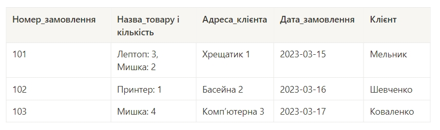
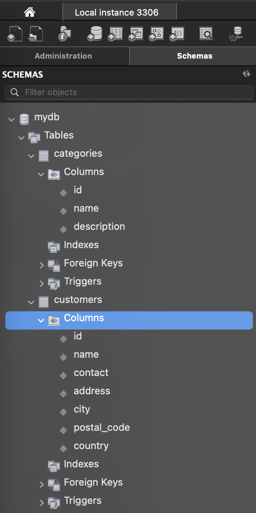
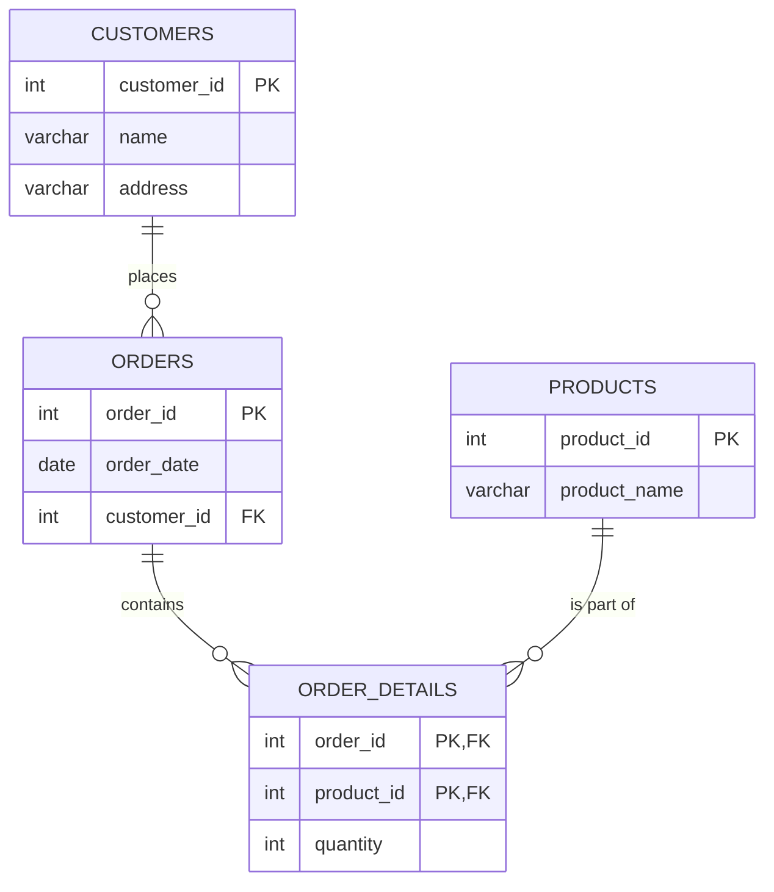
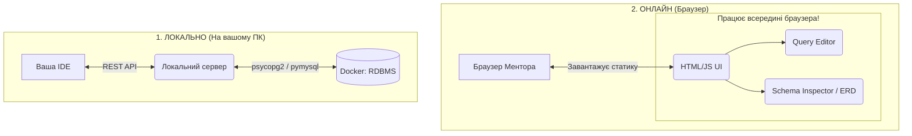
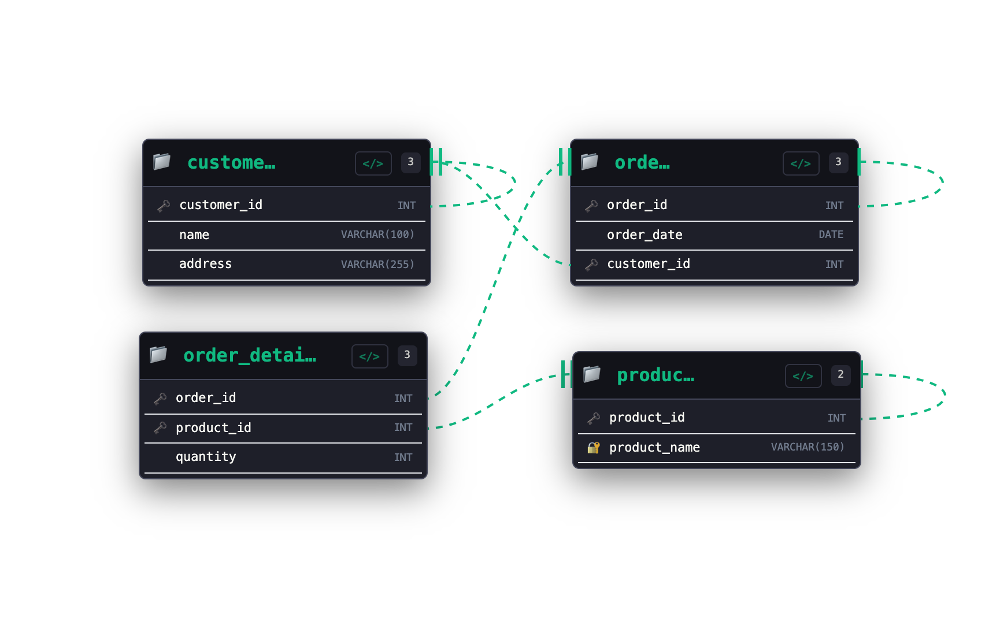
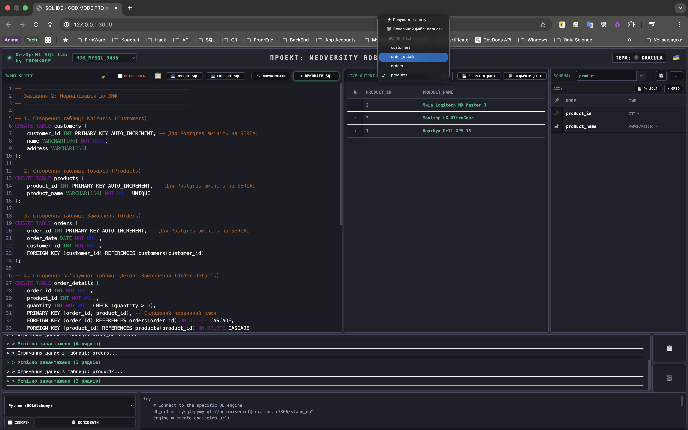

# goit-rdb-hw-02


***Технiчний опис завдань***

## **Тема 2: Проектування баз даних з використанням семантичних моделей**

### Вам потрібно буде:

- Перевести таблицю до такого стану, щоб вона відповідала вимогам першої, другої та третьої нормальної форм
- Створити ER-діаграму, що відображає взаємозв'язки між сутностями
- Створити таблиці в базі даних на основі ER-діаграми

### Це завдання допоможе вам:

- Опанувати техніку переведення даних у нормалізовану форму для забезпечення їхньої ефективності та послідовності
- Зрозуміти, як визначати й моделювати сутності та їхні взаємозв'язки, що є важливим для правильної організації інформації в базі даних

### Опис домашнього завдання:

1. Переведіть початкову таблицю в першу нормальну форму
2. Переведіть нові таблиці в другу нормальну форму
3. Переведіть нові таблиці в третю нормальну форму
4. Розробіть ER-діаграму отриманих таблиць

    > 💡 Використовуйте зрозумілі та конкретні імена для сутностей та атрибутів. Уточнюйте типи даних для атрибутів. Перевірте, чи всі відношення й атрибути мають чіткі і зрозумілі кардинальності та значення.

5. Використовуючи ER-діаграму, створіть таблиці в базі даних. Оформіть ці таблиці без конкретних значень, тільки з урахуванням колонок та їхніх зв'язків, вручну або автоматично

### Початкова таблиця:



### Критерії прийняття:

> **Критерії прийняття домашнього завдання є обов’язковою умовою оцінювання домашнього завдання ментором. Якщо якийсь з критеріїв не виконано, ДЗ відправляється ментором на доопрацювання без оцінювання.** Якщо вам “тільки уточнити”😉 або ви “застопорилися” на якомусь з етапів виконання— звертайтеся до ментора у Slack)

1. Прикріплені посилання на репозиторій goit-rdb-hw-02 та безпосередньо самі файли репозиторію архівом
2. Нормалізовано таблицю до 1НФ
3. Нормалізовано таблицю до 2НФ
4. Нормалізовано таблицю до 3НФ

    > 💡 Результат нормалізації таблиць може бути в довільній формі/форматі (Google Doc, Google таблиці тощо).

5. Створено ER-діаграму отриманих таблиць. Діаграма має відповідати нормалізованим таблицям

    > 💡 Має бути декілька таблиць зі зв’язком між ними. Результат може бути у вигляді файлу та/або скриншота.

6. Використано зрозумілі та конкретні імена для сутностей та атрибутів. Уточнено типи даних для атрибутів. Усі відношення й атрибути мають чіткі і зрозумілі кардинальності та значення
7. Створено таблиці в базі даних (тільки таблиці й колонки з урахуванням зв'язків) вручну або автоматично

> 💡 Результат має бути у вигляді скриншота розгорнутої схеми у Workbench.



---

## 🛡️ DevOpsML SQL Lab - Завдання 02 (goit-rdb-hw-02)

### 1. Як все запустити

Цей проект включає власну **SQL IDE - GOD MODE PRO**, розроблену для зручного виконання завдань без необхідності використовувати важкі десктопні клієнти типу MySQL Workbench.

Завдяки вбудованому оркестратору (`Makefile`), запуск і налаштування інфраструктури повністю автоматизовані та підтримують **Windows**, **macOS** та **Linux**.

#### 🚀 Швидкий запуск (В одну команду)

1. Клонуйте репозиторій на свій комп'ютер.
2. Переконайтесь, що у вас встановлені **Docker** та утиліта **Make**.
3. Створіть файл `.env` з паролями (дивіться `.env.example`, якщо він є).
4. У терміналі (в корені проекту) виконайте команду:

   ```bash
   make start
   ```

**Що автоматично зробить ця команда?**

- 🐳 Перевірить і самостійно запустить Docker (якщо він був вимкнений).
- 🧱 Підніме Backend-інфраструктуру (API ядро та Adminer).
- 📦 Ініціалізує ізольоване віртуальне середовище `.venv`.
- 🌐 Запустить Frontend-сервер.
- 🖥️ **Самостійно відкриє браузер** із готовою SQL IDE за адресою `http://127.0.0.1:3000`.

#### 📦 Створення Standalone-версії (Без сервера)

Якщо ви хочете зібрати весь застосунок у єдиний HTML-файл (для здачі ДЗ без необхідності розгортати сервер), виконайте:

```bash
make build
```

Це згенерує файл `hw_submission.html`, який міститиме всі стилі, скрипти та SQL-код. Його можна відкрити у будь-якому браузері напряму подвійним кліком.

#### 🛠️ Додаткові команди (Управління ядром)

Ваш термінал тепер — це пульт управління всіма базами даних. Ось основні команди:

- `make help` — показати інтерактивне меню з усіма доступними командами.
- `make db-manage` — відкрити CLI-менеджер фабрики баз даних (дозволяє на льоту створювати/видаляти контейнери з PostgreSQL, MySQL, MSSQL чи Oracle).
- `make db-adminer` — автоматично відкрити резервну панель **Adminer** у браузері (`http://127.0.0.1:8080`).
- `make down` — безпечно зупинити всі контейнери Backend-у.
- `make clean` — **Hard Reset**: жорстко видаляє всі згенеровані бази даних, контейнери, мережу та `.venv`, повертаючи проект до абсолютно чистого стану.

---

### 2. Структура проекту, ER-діаграма та Flowchart

#### Структура проекту

```text
goit-rdb-hw-02/
├── css/                        # 🎨 Стилі та оформлення
│   └── theme.css               # 🌗 Теми (Dracula/Alucard) та UI стилі
│
├── locales/                    # 🌍 Локалізація інтерфейсу
│   ├── uk.js                   # 🇺🇦 Український переклад
│   └── en.js                   # 🇬🇧 English translation
│
├── dicts/                      # 📚 Словники (IntelliSense)
│   └── *.json                  # 🧠 Синтаксис команд для різних СУБД
│
├── js/                         # ⚙️ Основна логіка застосунку
│   ├── core.js                 # 🚌 Event Bus (шина подій)
│   ├── config.js               # 🔧 Глобальні конфігурації
│   └── components/             # 🧩 Ізольовані модулі (QueryEditor, DataGrid, ERD)
│
├── sql/                        # 💾 Базові SQL-скрипти
│   └── default.sql             # 🏆 Еталонний скрипт нормалізації (3НФ) для ДЗ
│
├── index.html                  # 🌐 Головний інтерфейс IDE
├── builder.py                  # 🛠️ Python-бандлер для генерації Standalone-версії
├── Makefile                    # 🪄 Оркестратор команд (make build, make start)
├── hw_submission.html          # 📦 Зібраний All-in-One файл (генерується 'make build')
└── README.md                   # 📖 Документація проекту
```

#### ER-Діаграма (Третя нормальна форма - 3НФ)



#### Архітектура виконання



---

### 3. Висновки з усіма світлинами

#### Процес нормалізації

Початкова таблиця містила множинні значення у полі "Назва товару_кількість" та транзитивні залежності.

- **1НФ:** Розділено "Назва товару" та "Кількість" на окремі рядки (забезпечено атомарність значень).
- **2НФ:** Виділено сутності `orders` (замовлення) та `order_details` (деталі замовлення), щоб усунути часткову залежність від складеного ключа.
- **3НФ:** Виділено сутність `customers` (клієнти), оскільки адреса залежить від клієнта, а не безпосередньо від замовлення. Також виділено `products` (товари) для усунення дублювання назв та полегшення їх оновлення.

#### Результат нормалізації відображено у згенерованій ER-діаграмі нашої системи:

*ER-діаграма отриманих таблиць:*


*Таблиці в базі даних (Інтерфейс моєї IDE):*  


---

### 4. Аудит екосистеми: DevOpsML SQL Lab

Наша IDE складається з 6 повністю незалежних, але глибоко інтегрованих модулів. Кожен модуль відповідає за свою зону і спілкується з іншими через глобальний Event Bus (подієву архітектуру).

#### 🎛️ 1. Модуль: Workspace & Core (`core.js`, `1_WorkspaceHeader.js`)

| Назва Фічі | Що вона робить | Статус (Що реалізовано) | 🚀 Що можна покращити |
| :--- | :--- | :--- | :--- |
| **State Management** | Керує станом IDE між сесіями. | ✅ Зберігає поточну мову, тему (Dracula/Alucard) та обрану БД у `localStorage`. Завантажується миттєво без спалахів екрана. | Реалізувати експорт/імпорт усього Workspace State (налаштувань) у JSON файл. |
| **Event-Driven Architecture** | Зв'язує компоненти між собою. | ✅ Використовує події (`db-selected`, `dbs-loaded`, `lang-changed`), на які модулі реагують незалежно. | Додати глобальний Hotkey Manager для керування всіма вікнами з клавіатури. |

#### 📝 2. Модуль: Query Editor (`2_QueryEditor.js`)

| Назва Фічі | Що вона робить | Статус (Що реалізовано) | 🚀 Що можна покращити |
| :--- | :--- | :--- | :--- |
| **AST SQL Formatter** | "Причісує" SQL-код. | ✅ Використовує професійний `sql-formatter`. Вміє відрізняти діалекти (Postgres, MySQL, T-SQL) і форматує код відповідно до рушія. | - (Досягнуто архітектурного ідеалу). |
| **Режим Бога (God Mode)** | Жорстке виконання скриптів. | ✅ Автоматично перехоплює `CREATE TABLE` і додає перед ним `DROP TABLE IF EXISTS`, усуваючи конфлікти при тестуванні. | Зробити розумний парсинг `ALTER TABLE`, якщо таблиця вже має дані. |
| **IntelliSense** | Підказує SQL-команди. | ✅ Завантажує словники команд під конкретний рушій і підказує слова по `Tab`. | Додати автозаповнення назв таблиць та колонок із поточної схеми бази. |

#### 📊 3. Модуль: Data Grid & Import (`3_DataGrid.js`)

| Назва Фічі | Що вона робить | Статус (Що реалізовано) | 🚀 Що можна покращити |
| :--- | :--- | :--- | :--- |
| **Smart Import (CSV/JSON/SQL)** | Аналізує локальні файли. | ✅ Парсить CSV, робить Fallback на `Windows-1251` при проблемах з кодуванням, видаляє пусті колонки та рядки. | Додати парсинг Excel (`.xlsx`) прямо в браузері. |
| **Бойовий Транзакційний Імпорт** | Заливає файли у БД. | ✅ Автоматично вираховує типи колонок (Type Inference), має модалку мапінгу та б'є великі файли на чанки по 5000 рядків, огортаючи їх у `BEGIN/COMMIT`. | Показувати Progress Bar при імпорті надвеликих масивів даних. |
| **Віртуалізована Пагінація** | Показує великі таблиці. | ✅ Має інпут для переходу та підтримку "Long Press" (1.3 сек) для миттєвого стрибка на першу/останню сторінку. | Додати можливість редагування клітинок прямо в таблиці (Inline CRUD). |

#### 🗄️ 4. Модуль: Schema Inspector & ERD (`4_SchemaInspector.js`)

| Назва Фічі | Що вона робить | Статус (Що реалізовано) | 🚀 Що можна покращити |
| :--- | :--- | :--- | :--- |
| **Топологічна Сітка (DAG)** | Малює ієрархію таблиць. | ✅ Аналізує зв'язки, знаходить ізольовані компоненти і шикує їх зліва-направо (від батьків до дітей), запобігаючи накладанню (Overlap). | Додати виявлення кільцевих залежностей (Circular Dependencies). |
| **Абсолютна Кардинальність** | Малює стрілки (Crow's Foot). | ✅ Підтримує всі 6 стандартів нотації. Відрізняє строгі ключі від евристичних. Ідеально вимальовує вигнуті петлі для Self-Joins. | Можливість клікнути на лінію зв'язку і згенерувати `ALTER TABLE DROP CONSTRAINT`. |
| **Динамічний Експорт** | Робить знімок (PNG/SVG). | ✅ Розгортає таблиці повністю, малює лінії зв'язку, підраховує рамку (Bounding Box) і зберігає з ідеальним Padding (120px). | Автоматичне завантаження діаграми у GitHub або Markdown звіт. |

#### 📟 5. Модуль: Console Logger (`5_ConsoleLogger.js`)

| Назва Фічі | Що вона робить | Статус (Що реалізовано) | 🚀 Що можна покращити |
| :--- | :--- | :--- | :--- |
| **Real-time Output** | Виводить системні події. | ✅ Використовує оптимізований рендер `insertAdjacentHTML` для запобігання перемальовуванню всього DOM. Автоматично скролить до останнього повідомлення. | Додати фільтрацію логів (Помилки / Успіх / Інфо) за допомогою табів. |
| **Log Management** | Керування текстом логів. | ✅ Кнопки для миттєвого очищення та копіювання всіх логів у буфер обміну з відповідною локалізацією підказок. | Можливість експортувати історію логів у `.log` або `.txt` файл. |

#### 💻 6. Модуль: Snippet Engine (`6_SnippetEngine.js`)

| Назва Фічі | Що вона робить | Статус (Що реалізовано) | 🚀 Що можна покращити |
| :--- | :--- | :--- | :--- |
| **Генератор бекенд-коду** | Перетворює SQL у готовий код. | ✅ Підтримує 13 мов (Python, C#, Java, Go, Rust, TypeScript, Dart тощо). Динамічно підставляє імпорти та DSN-рядки залежно від обраної СУБД. | Додати генератор ORM-моделей (напр., генерація класів Entity Framework або SQLAlchemy моделей). |
| **Toggle Imports** | Управління структурою сніпета. | ✅ Дозволяє швидко вмикати/вимикати показ `import / using / require` у згенерованому коді через чекбокс. | Підтримка створення кастомних користувацьких шаблонів сніпетів (Custom Templates). |
