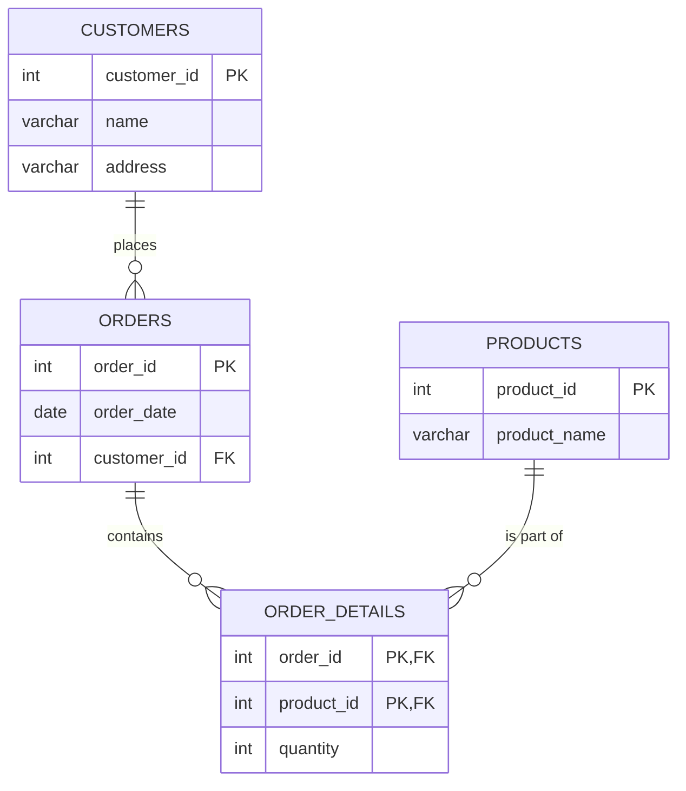
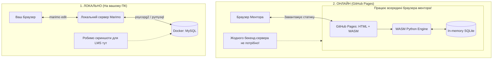

# goit-rdb-hw-02

***Технiчний опис завдань***

# **Завдання 2: Проектування баз даних з використанням семантичних моделей**

***Вам потрібно буде:***

- Перевести таблицю до такого стану, щоб вона відповідала вимогам першої, другої та третьої нормальної форм
- Створити ER-діаграму, що відображає взаємозв'язки між сутностями
- Створити таблиці в базі даних на основі ER-діаграми

***Це завдання допоможе вам:***

- Опанувати техніку переведення даних у нормалізовану форму для забезпечення їхньої ефективності та послідовності
- Зрозуміти, як визначати й моделювати сутності та їхні взаємозв'язки, що є важливим для правильної організації інформації в базі даних

## **Опис домашнього завдання:**

1. Переведіть початкову таблицю в першу нормальну форму
2. Переведіть нові таблиці в другу нормальну форму
3. Переведіть нові таблиці в третю нормальну форму
4. Розробіть ER-діаграму отриманих таблиць

> 💡 Використовуйте зрозумілі та конкретні імена для сутностей та атрибутів. Уточнюйте типи даних для атрибутів. Перевірте, чи всі відношення й атрибути мають чіткі і зрозумілі кардинальності та значення.

5. Використовуючи ER-діаграму, створіть таблиці в базі даних. Оформіть ці таблиці без конкретних значень, тільки з урахуванням колонок та їхніх зв'язків, вручну або автоматично

***Початкова таблиця:***


Критерії прийняття:

> **Критерії прийняття домашнього завдання є обов’язковою умовою оцінювання домашнього завдання ментором. Якщо якийсь з критеріїв не виконано, ДЗ відправляється ментором на доопрацювання без оцінювання.** Якщо вам “тільки уточнити”😉 або ви “застопорилися” на якомусь з етапів виконання— звертайтеся до ментора у Slack)

1. Прикріплені посилання на репозиторій goit-rdb-hw-02 та безпосередньо самі файли репозиторію архівом
2. Нормалізовано таблицю до 1НФ
3. Нормалізовано таблицю до 2НФ
4. Нормалізовано таблицю до 3НФ

> 💡 Результат нормалізації таблиць може бути в довільній формі/форматі (Google Doc, Google таблиці тощо).

5. Створено ER-діаграму отриманих таблиць. Діаграма має відповідати нормалізованим таблицям

> 💡 Має бути декілька таблиць зі зв’язком між ними. Результат може бути у вигляді файлу та/або скриншота.

6. Використано зрозумілі та конкретні імена для сутностей та атрибутів. Уточнено типи даних для атрибутів. Усі відношення й атрибути мають чіткі і зрозумілі кардинальності та значення
7. Створено таблиці в базі даних (тільки таблиці й колонки з урахуванням зв'язків) вручну або автоматично

> 💡 Результат має бути у вигляді скриншота розгорнутої схеми у Workbench.


## Підсумки проектування та нормалізація баз даних

### Процес нормалізації

Початкова таблиця містила множинні значення у полі "Назва товару_кількість" та транзитивні залежності.

* **1НФ:** Розділено "Назва товару" та "Кількість" на окремі рядки (атомарні значення).
* **2НФ:** Виділено сутність `Orders` (замовлення) та `Order_Details` (деталі замовлення), щоб усунути часткову залежність від складеного ключа.
* **3НФ:** Виділено сутність `Customers` (клієнти), оскільки адреса залежить від клієнта, а не безпосередньо від замовлення. Також виділено `Products` (товари) для усунення дублювання назв.

Цей репозиторій містить рішення завдання з нормалізації баз даних (відведення до 1НФ, 2НФ та 3НФ) з використанням ізольованої інфраструктури (Docker, RDBMS).

### Інструкція з розгортання

1. Клонувати репозиторій.
2. Створити файл `.env` з паролями (дивіться `.env.example`, якщо він є).
3. Виконати команду: `make setup`
4. Для перегляду інтерактивного застосунку: `make dev`
5. Управління БД доступне за адресою: `http://localhost:8080` (Adminer).

### ER-Діаграма (Третя нормальна форма - 3НФ)





### Структура проекту

```text
goit-rdb-hw-02/
├── .env                        # 🔒 Секрети (ігнорується Git)
├── .env.example                # 📄 Шаблон секретів для GitHub
├── .editorconfig               # ⚙️ Правила стилю коду для IDE
├── .gitignore                  # 🚫 Файл ігнорування артефактів
├── Makefile                    # 🪄 Оркестратор команд
├── docker-compose.yml          # 🐳 Інфраструктура проєкту
├── app.py                      # 🐍 Логіка та UI дашборда (Marimo)
├── README.md                   # 📖 Документація та ER-діаграми
│
├── init-scripts/               # 📂 Скрипти автонаповнення БД (опціонально)
│   ├── mysql/
│   │   └── 01_hw02_schema.sql  
│   └── postgres/
│       └── 01_hw02_schema.sql  
│
├── venv/                       # 📁 Віртуальне середовище (генерується 'make setup')
└── hw_submission.html          # 📦 Зібраний файл для здачі (генерується 'make build')
```
